# 禮寵 Reiko Pet — 寵物美容預約系統

> 軟體工程與管理學系 大三期末專案 · 國立高雄師範大學

一套功能完整的寵物美容預約平台，涵蓋前台預約流程、線上商城、寵物住宿，以及完整的後台管理系統。

---

## Tech Stack

| 類別 | 技術 |
|------|------|
| 後端框架 | Laravel 12 (PHP 8.3) |
| 前端 | Tailwind CSS v4 · Alpine.js · Vite |
| 資料庫 | SQLite (本地開發) · MySQL (生產環境) |
| 認證 | Laravel Breeze |
| 測試 | PHPUnit |

---

## 功能總覽

### 前台

- **預約流程**：5 步驟精靈（服務 → 加購 → 門市 → 寵物 → 確認），多種寵物類型與體型篩選
- **統一結帳頁**：美容預約、寵物住宿、商城訂單共用一套結帳流程，支援優惠券折抵
- **優惠券系統**：公開 / 會員限定 / 個人專屬三種 Visibility，結帳頁快選
- **線上商城**：商品瀏覽、購物車、庫存驗證（結帳前驗證 + 付款後扣除）
- **寵物住宿**：房型選擇、體重篩選、自動帶入會員寵物資料
- **會員中心**：個人資料、寵物管理、預約記錄、住宿記錄、訂單記錄、近期優惠
- **文章專欄**：寵物保養知識、美容小知識

### 後台管理

- **Dashboard**：待確認預約、商品庫存、會員數、總預約數統計
- **美容預約管理**：5 狀態系統（待確認 / 確認 / 美容中 / 完成 / 取消），狀態標籤過濾
- **住宿管理**：房型 CRUD + Toggle 啟用狀態；住宿預約 5 狀態管理
- **商城管理**：商品 CRUD + 庫存管理；訂單狀態追蹤
- **會員管理**：會員列表（含寵物數、預約數）、帳號管理
- **優惠券管理**：建立 / 停用、首頁推薦 Toggle、結帳頁快選
- **內容管理 (CMS)**：首頁 Hero 圖、品牌理念、關於我們、傳單管理
- **AJAX 導覽**：後台使用 `fetch` + `history.pushState` 無重整切換頁面

---

## 系統截圖

### 前台

| 首頁 | 服務介紹 | 線上商城 |
|:---:|:---:|:---:|
| 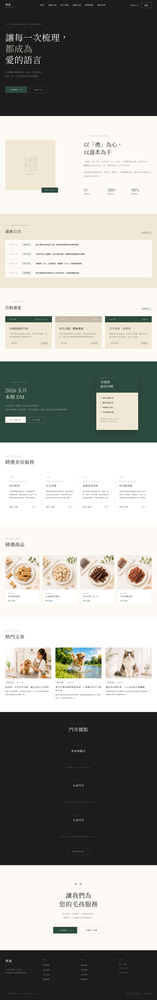 | 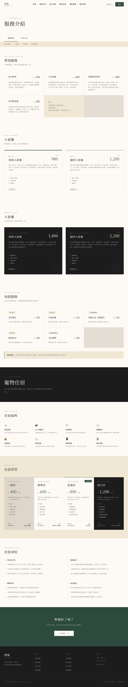 | 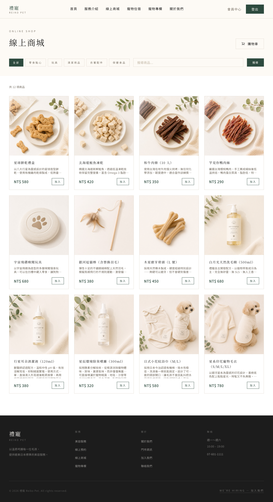 |

| 文章專欄 | 關於我們 |
|:---:|:---:|
| 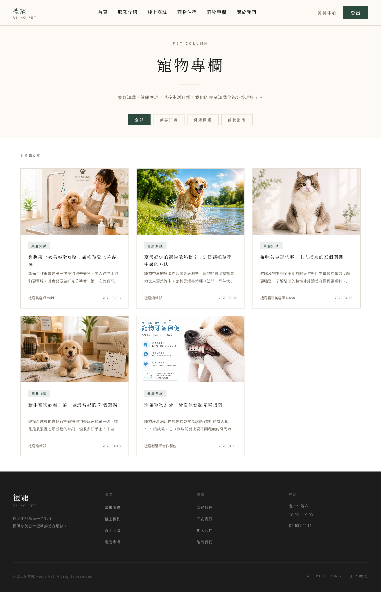 | 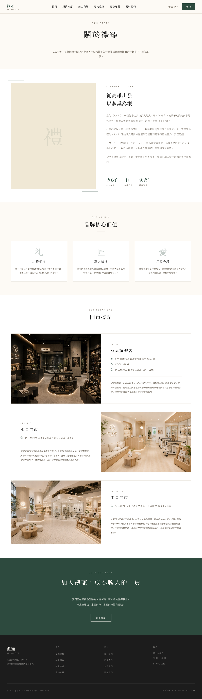 |

### 預約流程（5 步驟）

| Step 1 選擇服務 | Step 2 加購項目 | Step 3 選擇門市 |
|:---:|:---:|:---:|
| 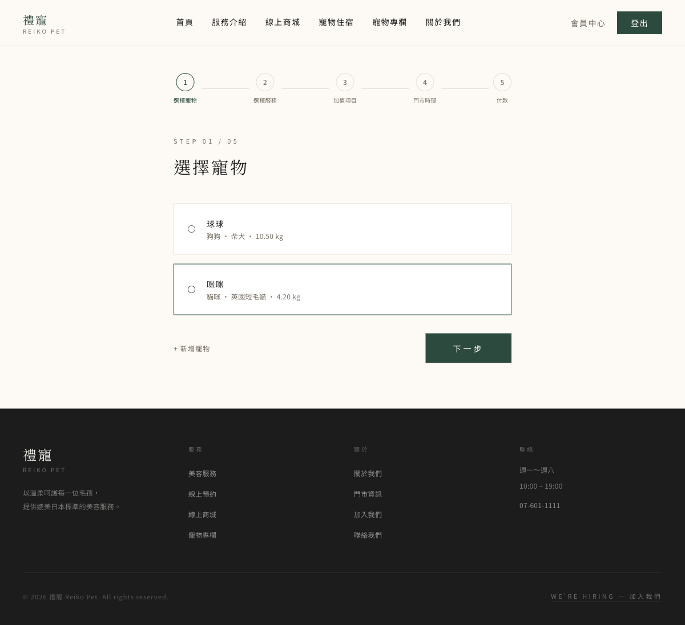 | 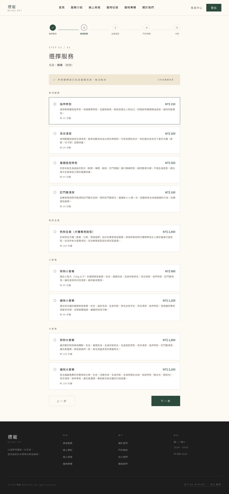 | 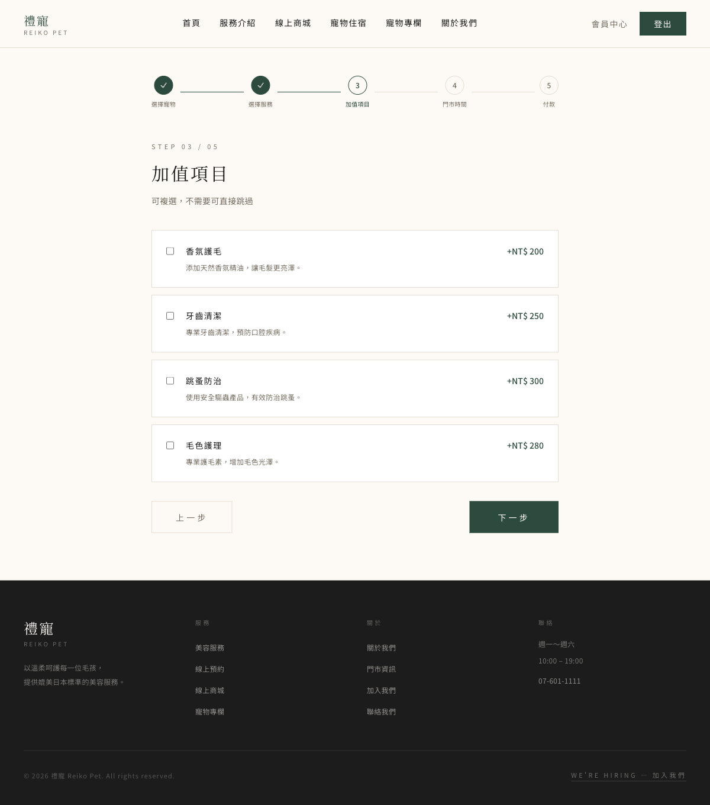 |

| Step 4 寵物資料 | Step 5 確認明細 | 完成預約 |
|:---:|:---:|:---:|
| 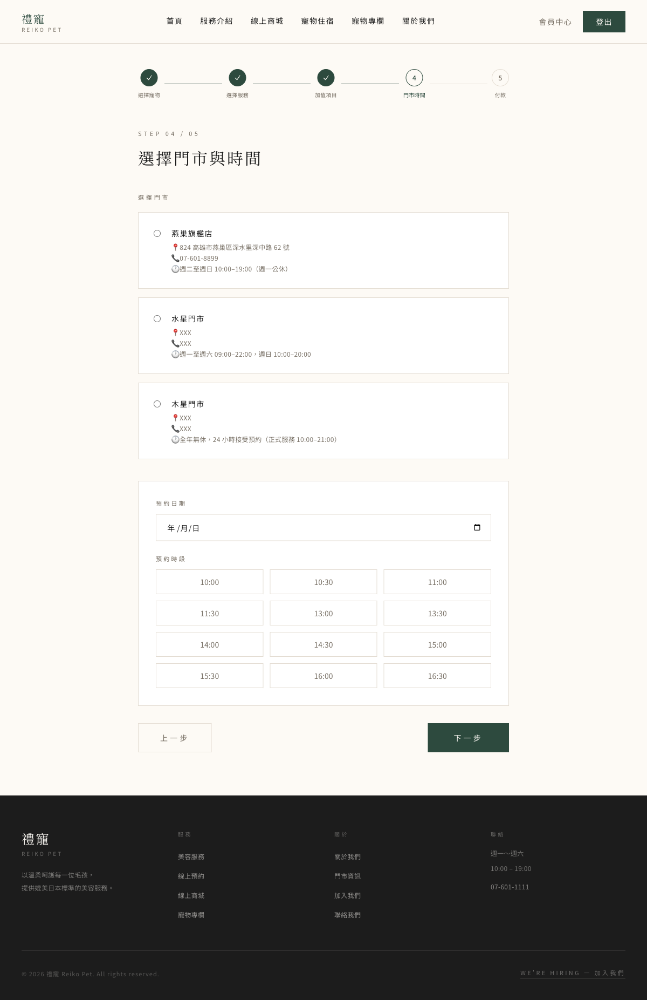 | 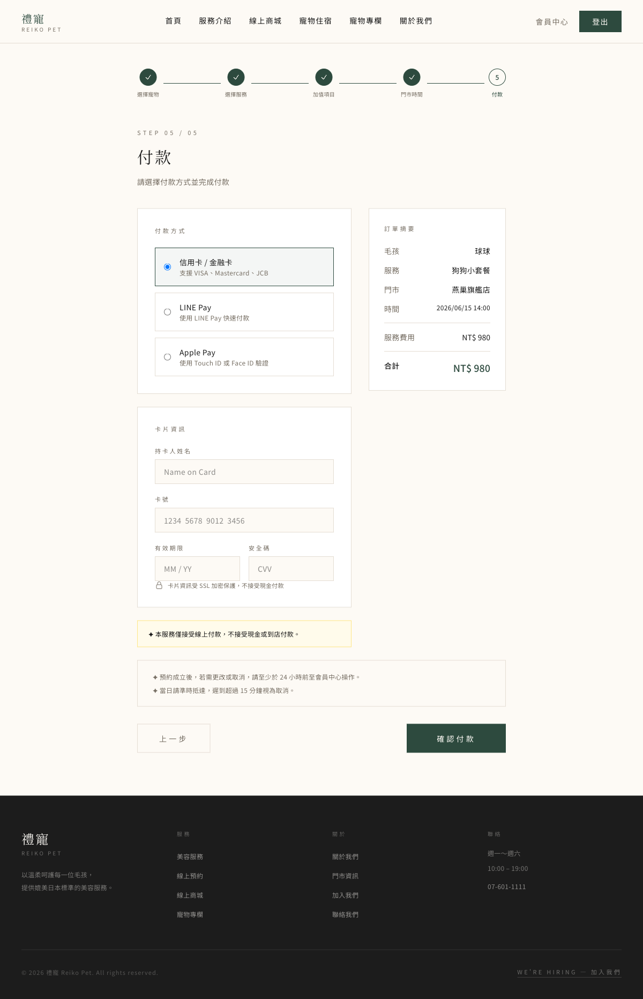 | 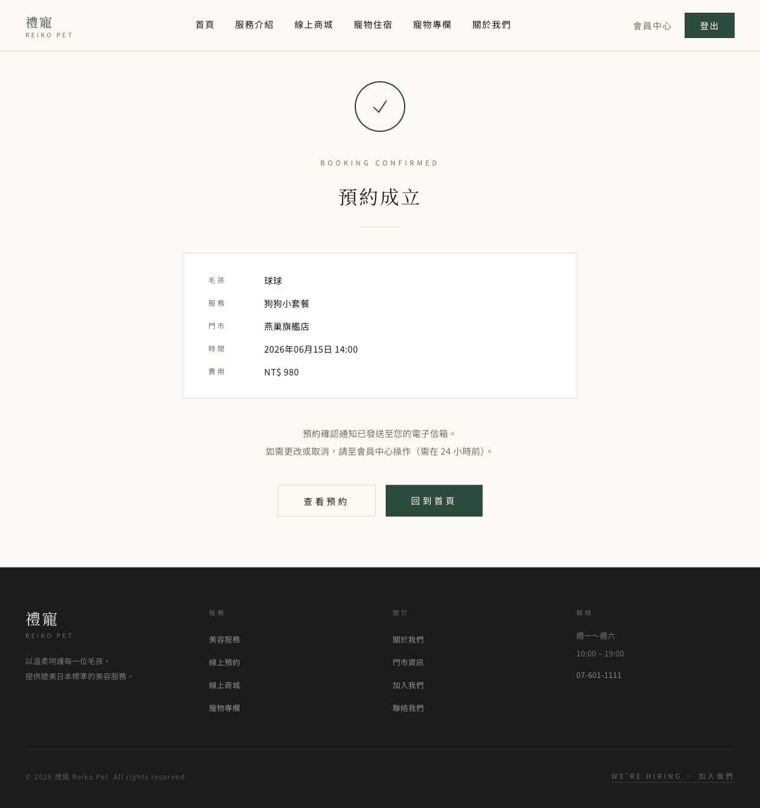 |

### 會員與後台

| 會員中心 | 後台 Dashboard |
|:---:|:---:|
| 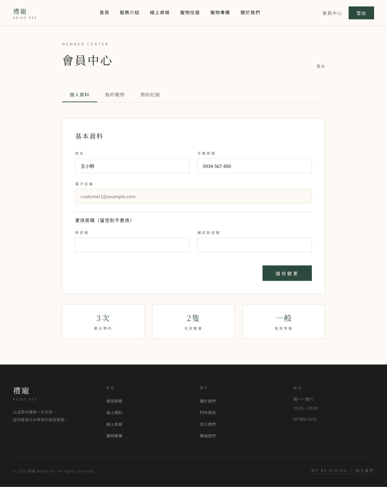 | 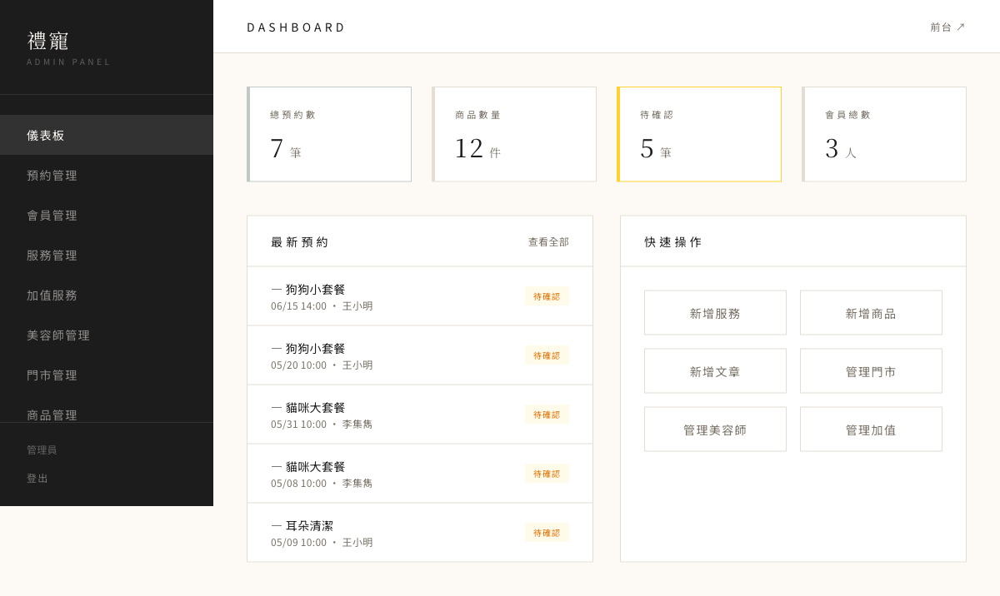 |

| 後台預約管理 | 後台服務管理 |
|:---:|:---:|
| 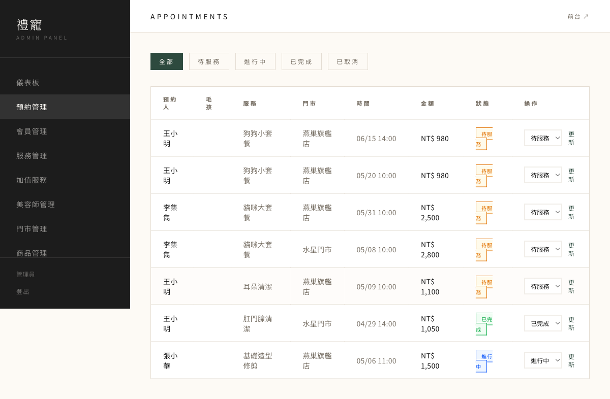 | 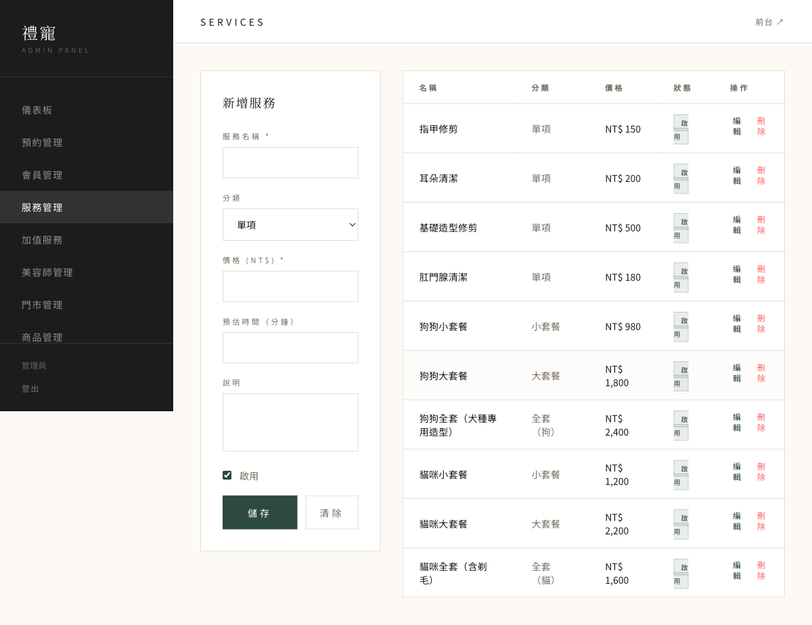 |

---

## 快速開始

### 需求

- PHP >= 8.3
- Composer
- Node.js >= 18

### 安裝步驟

```bash
# 1. Clone 專案
git clone https://github.com/your-username/reiko-pet.git
cd reiko-pet

# 2. 安裝 PHP 相依
composer install

# 3. 安裝前端相依
npm install

# 4. 設定環境變數
cp .env.example .env
php artisan key:generate

# 5. 建立資料庫（SQLite）
touch database/database.sqlite

# 6. 執行 Migration + Seed（含範例資料）
php artisan migrate --seed

# 7. 建立 storage 連結
php artisan storage:link

# 8. 編譯前端
npm run build

# 9. 啟動開發伺服器
php artisan serve
```

開啟 `http://localhost:8000` 即可使用。

### 預設帳號

執行 seed 後可使用以下帳號登入：

| 角色 | Email | 密碼 |
|------|-------|------|
| 管理員 | admin@reiko.pet | password |
| 美容師 | groomer@reiko.pet | password |
| 一般會員 | member@reiko.pet | password |

---

## 專案結構

```
app/
├── app/
│   ├── Http/Controllers/       # 路由控制器
│   │   └── Admin/              # 後台控制器群組
│   ├── Models/                 # Eloquent Models
│   └── Services/
│       └── CartService.php     # 購物車 Session 服務
├── database/
│   ├── migrations/             # 資料表結構定義
│   └── seeders/                # 範例資料（13 個 Seeder）
├── resources/
│   └── views/
│       ├── layouts/            # 前台 / 後台 Layout
│       ├── admin/              # 後台頁面
│       └── ...                 # 前台頁面
├── routes/
│   └── web.php                 # 所有路由定義
└── screenshots/                # 系統截圖
```

---

## 開發者

**李集雋** · 國立高雄師範大學 軟體工程與管理學系

組員：陳宗佑、詹皓宇
